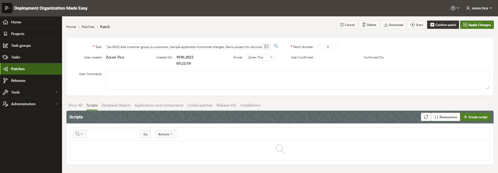
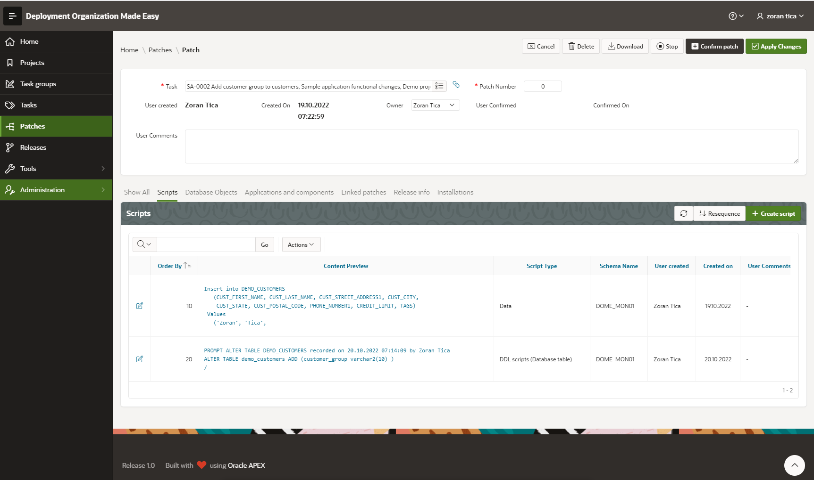
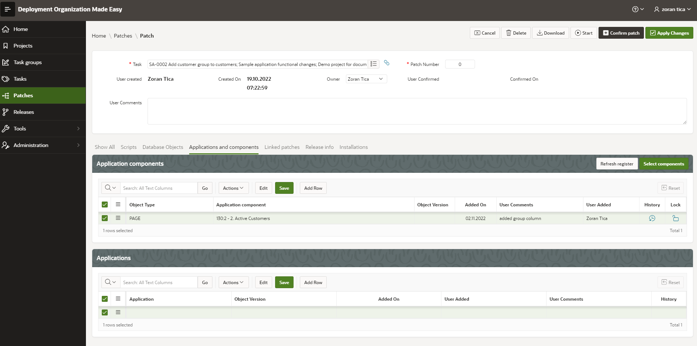
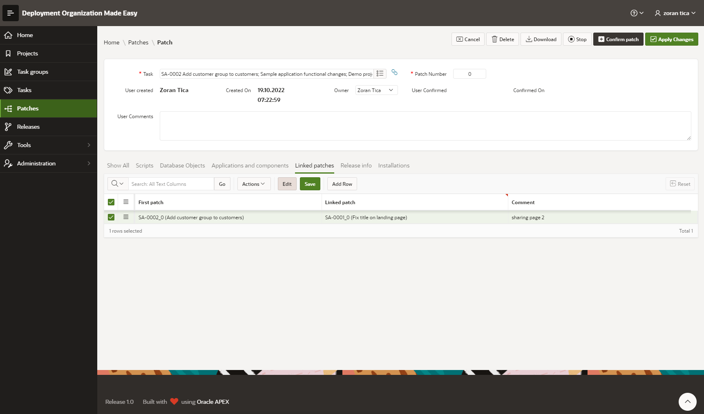
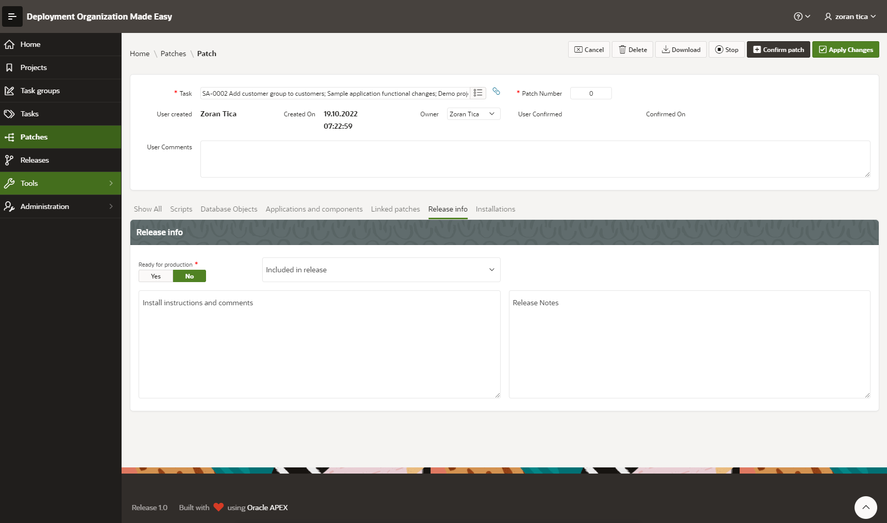

# A Structure of Patch
APEX page with patch details looks like this:

It is structured from:
- basic patch data
- scripts
- database objects
- applications and application components
- linked patches information
- release information
- installations

## Basic Patch Data
Accessible in topmost part of the page.

Within basic data a DOME user can:
- select task and patch number
- change owner 
- write additional comments

Additionally, data about patch creation (created by and created on) and patch confirmation (confirmed by and confirmed on) are displayed.

## Scripts
Accessible in lower part of the page, "Scripts" tab.
On this tab a DOME user can add scripts manually (for example DML scripts) or review recorded DDL scripts.

## Database Objects
Accessible in lower part of the page, "Database Objects" tab.
On this tab all database objects, which were affected by DDL activities can be seen.
Some of them (like tables) are only listed here and their actual DDL scripts are located among Scripts (see previous chapter "Scripts").
Others - like packages, procedures, functions, types (and similar), which can be created or replaced, are listed as actual and active objects, which scripts will be generated when DOME user confirms a patch.

Objects can be added manually or they can be recorded from monitored schema(s).
For example, when schema is monitored and package is compiled, it will be automatically added to patch database objects.

## Applications and Application Components
Accessible in lower part of the page, "Applications and Components" tab.
On this tab all applications or application components, which are included in patch can be accessed.

Applications and components can be added to patch manually.
On this tab it is also possible to refresh application components register by clicking on Refresh register button (see TODO). 

## Linked patches
Accessible in lower part of the page, "Linked Patches" tab.
In order to share objects between patches (which is impossible because of concurrency control within DOME), patches should be linked.

If needed, multiple patches can be linked.

## Release Information
Accessible in lower part of the page, "Release Info" tab.
On this tab DOME user can:
- include the patch in a release
- mark patch as ready for production
- write down optional installation instructions and comments
- write down release notes

## Installations
Accessible in lower part of the page, "Installations" tab.
Installations provide a information, on which environment is the patch installed and when.
Those information can be entered manually or provided automatically by patch scripts installation tool (like OPAL tools, for example).

Data can be entered only when patch is confirmed.

